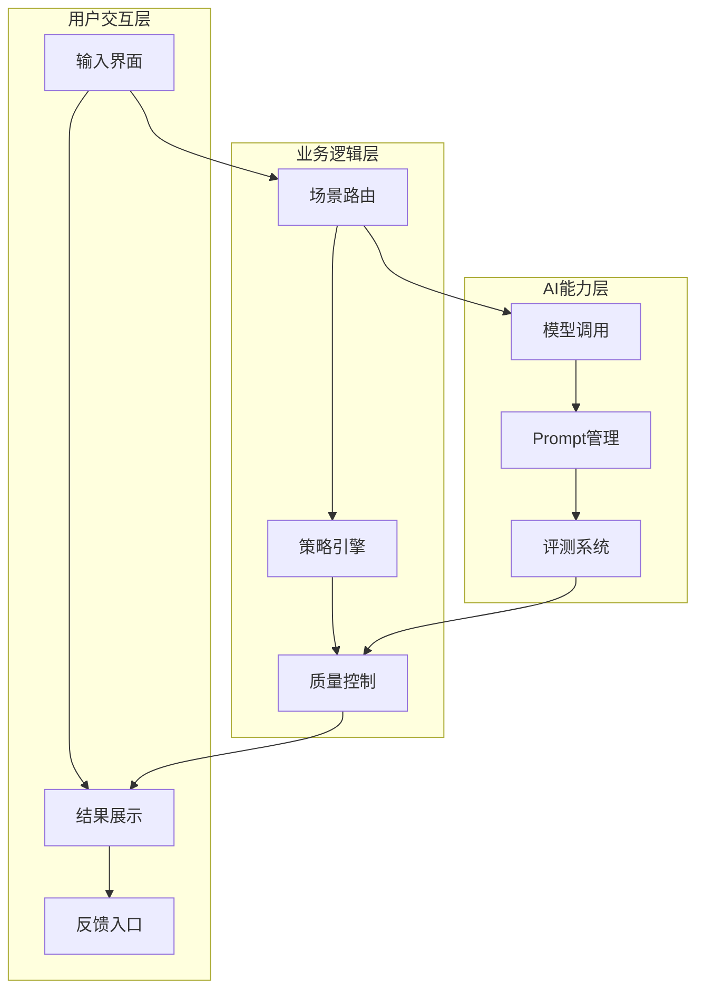
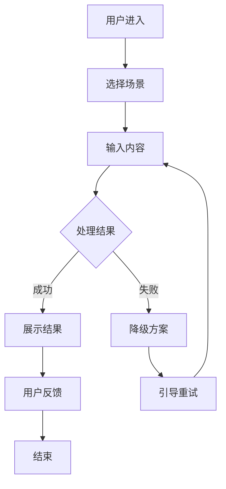
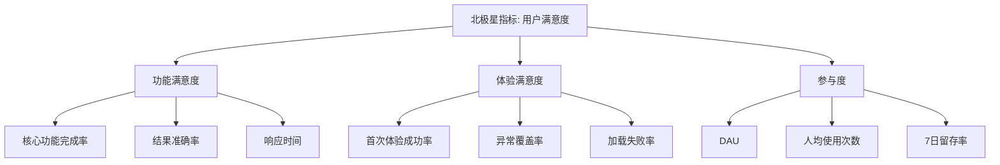
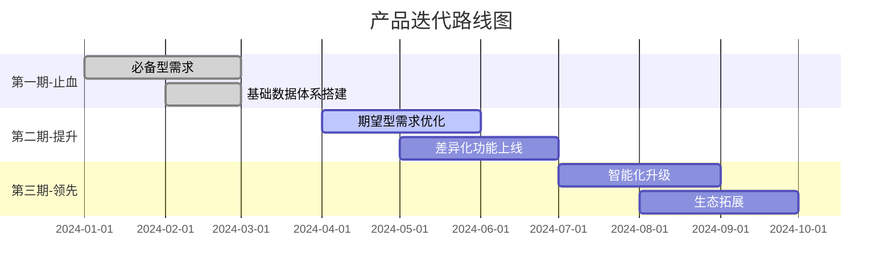

# 面试图表生成指南

## 使用说明

面试准备中，图表能帮你理清思路、辅助记忆，也能在面试后复盘时可视化产品逻辑。本指南涵盖面试常用图表类型、文本模板和生成方法。

---

## 常用图表类型

### 1. 产品架构图

**展示什么**：产品的模块组成和模块之间的关系，帮助面试官快速理解"你做了什么"。

**什么时候用**：
- 讲项目开头，快速建立全局认知
- 被追问"整体架构是什么"时

**文本模板**：
```
┌─────────────────────────────────┐
│           用户交互层             │
│  [输入界面] [结果展示] [反馈入口]  │
├─────────────────────────────────┤
│           业务逻辑层             │
│  [场景路由] [策略引擎] [质量控制]  │
├─────────────────────────────────┤
│           AI能力层              │
│  [模型调用] [Prompt管理] [评测系统] │
├─────────────────────────────────┤
│           数据层                │
│  [埋点采集] [指标计算] [数据看板]  │
└─────────────────────────────────┘
```

**Mermaid语法示例**：


---

### 2. 用户流程图

**展示什么**：用户从进入到完成核心任务的完整路径，包括关键分支和异常处理。

**什么时候用**：
- 讲核心功能的交互设计
- 被追问"用户怎么使用"时

**文本模板**：
```
用户进入 → 选择场景 → 输入内容 → 等待处理
                                    ↓
                          ┌── 成功 → 展示结果 → 用户反馈 → 结束
                          │
                          └── 失败 → 降级方案 → 引导重试
```

**Mermaid语法示例**：


---

### 3. 指标树

**展示什么**：北极星指标如何拆解为可执行的子指标，展示"指标→行动"的完整链路。

**什么时候用**：
- 讲数据体系设计
- 被追问"你怎么衡量成功"时

**文本模板**：
```
北极星指标：用户满意度评分
├── 功能满意度
│   ├── 核心功能完成率
│   ├── 结果准确率
│   └── 响应时间P50/P90
├── 体验满意度
│   ├── 首次体验成功率
│   ├── 异常场景覆盖率
│   └── 加载失败率
└── 参与度
    ├── 日活跃用户数
    ├── 人均使用次数
    └── 7日留存率
```

**Mermaid语法示例**：


---

### 4. 评测维度图

**展示什么**：AI产品评测体系的维度和权重关系，展示"怎么评估AI效果"。

**什么时候用**：
- 讲AI能力设计和评测方法论
- 被追问"你怎么评估模型效果"时

**文本模板**：
```
评测体系
├── 维度1: 准确性（权重40%）
│   ├── 评测方法：人工标注 + 自动化对比
│   ├── 评测集：500条线上真实case
│   └── 合格线：≥85%
├── 维度2: 完整性（权重25%）
│   ├── 评测方法：关键信息点覆盖率
│   ├── 评测集：同上
│   └── 合格线：≥90%
├── 维度3: 流畅性（权重20%）
│   ├── 评测方法：人工打分（1-5分）
│   ├── 评测集：200条随机抽样
│   └── 合格线：≥4.0
└── 维度4: 时效性（权重15%）
    ├── 评测方法：端到端响应时间
    ├── 评测集：全量监控
    └── 合格线：P90 ≤ 3s
```

---

### 5. 技术方案对比图

**展示什么**：关键技术决策中考虑过的方案、对比维度和最终选择依据。

**什么时候用**：
- 讲技术方案选型
- 被追问"你们为什么选这个方案"时

**文本模板**：
```
| 对比维度     | 方案A         | 方案B          | 方案C（最终选择）|
|-------------|--------------|---------------|----------------|
| 准确率       | 78%          | 82%           | 88%            |
| 响应时间     | 1.2s         | 2.5s          | 1.8s           |
| 成本/次      | ¥0.01        | ¥0.05         | ¥0.03          |
| 可扩展性     | 低            | 中             | 高              |
| 综合判断     | 准确率不达标   | 成本过高        | 综合最优         |
```

---

### 6. 产品迭代路线图

**展示什么**：产品分阶段的迭代策略，展示产品节奏感。

**什么时候用**：
- 讲产品规划和节奏把控
- 被追问"你们的roadmap是什么"时

**Mermaid语法示例**：


---

## 生成方法

### 方法一：Mermaid渲染
- 在Markdown编辑器（Obsidian、Typora）中直接使用 ```mermaid 代码块
- 在线工具：mermaid.live 可实时预览和导出
- 适合：流程图、架构图、甘特图

### 方法二：飞书画板（lark-whiteboard）
- 通过 lark-whiteboard skill 创建可视化图表
- 适合：需要分享给他人或嵌入飞书文档的场景
- 支持：流程图、思维导图、架构图

### 方法三：文本图
- 直接用ASCII字符画图，嵌入Markdown
- 适合：快速记忆、面试现场白板
- 优点：不依赖工具，任何地方都能用

---

## 图表设计原则

### 核心原则：简洁优先

1. **3-5个核心节点** — 面试中图表是辅助记忆，不是完整文档。超过7个节点就太复杂了。
2. **一张图说清一件事** — 不要在一张图里塞架构+流程+指标。分开画。
3. **有层次感** — 用分层结构（上下或左右）体现逻辑关系。
4. **关键节点有标注** — 在最重要的节点上加数据或判断依据。
5. **颜色/样式克制** — 最多3种颜色区分，不要花里胡哨。

### 面试场景特殊要求

- 面试官看图的时间不超过10秒 → 核心信息必须一眼可见
- 图表是引出讨论的工具 → 不需要自解释，配合口述
- 准备多不如准备精 → 一个项目2-3张核心图就够
