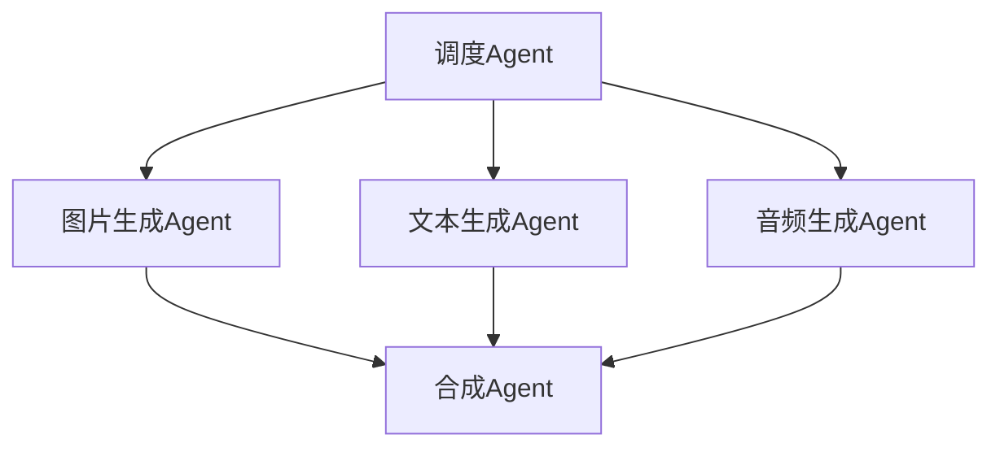
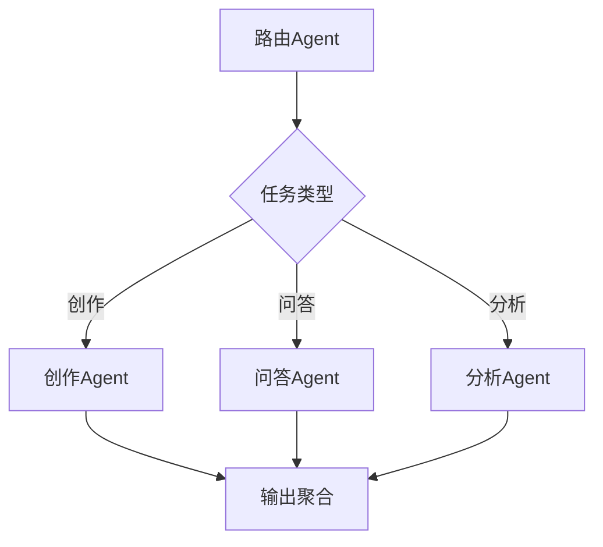

# AI产品专属模块指南

本文档为AI产品PRD中特有的模块提供详细写作模板和示例。这些模块是AI产品PRD区别于传统产品PRD的核心差异点。

---

## 模块一：模型能力设计

### 写作目标

让技术团队理解模型选型的逻辑、能力边界的定义、以及降级策略的设计。

### 1.1 模型选型

**写作框架**：

```
选型维度：
├── 能力匹配度：模型能力是否覆盖产品需求
├── 性能要求：延迟、吞吐量、并发支持
├── 成本约束：Token成本、部署成本、运维成本
├── 合规要求：数据驻留、内容安全、隐私保护
└── 生态成熟度：SDK支持、社区活跃度、文档完善度
```

**选型对比表模板**：

| 评估维度 | 权重 | 模型A | 模型B | 模型C |
|---------|------|-------|-------|-------|
| 文本理解能力 | 25% | 9/10 | 8/10 | 7/10 |
| 生成质量 | 25% | 9/10 | 7/10 | 8/10 |
| 响应延迟 | 20% | 2s | 1.5s | 3s |
| Token单价 | 15% | $$$ | $$ | $ |
| 多模态支持 | 10% | 支持 | 不支持 | 部分支持 |
| 中文能力 | 5% | 优秀 | 良好 | 一般 |
| **加权总分** | 100% | **8.5** | **7.2** | **6.8** |

**选型结论模板**：
> 综合评估，选择[模型A]作为主力模型，原因：
> 1. 在核心能力（文本理解+生成质量）上得分最高
> 2. 多模态支持覆盖未来V1.5版本需求
> 3. 延迟可接受，可通过流式输出优化体感
>
> 备选方案：[模型B]作为降级模型，用于高并发场景的成本优化。

### 1.2 能力边界定义

**写作框架**：

| 能力维度 | 能做什么 | 不能做什么 | 降级策略 |
|---------|---------|-----------|---------|
| 文本生成 | 生成500字以内的结构化内容 | 生成超长文档（>3000字）质量无保证 | 分段生成 + 拼接 |
| 知识问答 | 回答训练数据覆盖范围内的问题 | 回答实时信息、个人隐私信息 | 标注"信息可能过时" + RAG补充 |
| 多轮对话 | 保持10轮以内的上下文连贯 | 超长对话上下文丢失 | 滚动摘要 + 关键信息锚定 |
| 推理分析 | 简单逻辑推理和数据分析 | 复杂数学证明、代码调试 | 明确提示用户这超出了AI能力 |

### 1.3 降级策略

**三级降级机制**：

```
L1 - 模型级降级：主力模型不可用 → 切换备选模型
    触发条件：主模型连续3次超时或返回错误
    用户感知：响应可能略慢，质量基本不变
    自动恢复：每5分钟探测主模型状态

L2 - 功能级降级：AI能力整体降级 → 关闭高级功能
    触发条件：所有模型不可用或延迟>10s
    用户感知：提示"AI能力暂时受限"，仅保留基础功能
    自动恢复：每1分钟探测服务状态

L3 - 服务级降级：完全离线 → 本地缓存兜底
    触发条件：网络不可用
    用户感知：提示"离线模式"，展示缓存内容
    自动恢复：网络恢复后自动同步
```

---

## 模块二：Prompt工程

### 写作目标

定义Prompt策略，确保AI输出的质量、一致性和安全性。

### 2.1 System Prompt结构

**标准结构模板**：

```
System Prompt 结构：
├── 角色定义（Role）
│   └── 你是[角色]，专注于[领域]，具备[能力]
├── 行为准则（Rules）
│   ├── 必须做的（DO）
│   ├── 禁止做的（DON'T）
│   └── 输出格式要求
├── 上下文注入（Context）
│   ├── 用户画像信息
│   ├── 场景上下文
│   └── 知识库检索结果
├── 输出控制（Output Control）
│   ├── 语言风格
│   ├── 长度限制
│   └── 格式要求
└── 安全护栏（Guardrails）
    ├── 内容边界
    ├── 拒绝策略
    └── 降级话术
```

**示例**：

```
你是一位专业的[领域]助手，帮助用户完成[核心任务]。

## 行为准则
- 始终用中文回复，语气专业友好
- 回答长度控制在200字以内，除非用户要求详细展开
- 不确定的信息必须标注"以上为AI生成，建议核实"
- 禁止生成虚假信息、有害内容、政治敏感内容

## 上下文
- 用户名：{user_name}
- 当前场景：{scene_context}
- 参考知识：{rag_results}

## 输出格式
- 使用Markdown格式
- 关键信息加粗标注
- 步骤类内容使用有序列表
```

### 2.2 Few-shot示例设计

**设计原则**：
- 示例数量：2-3个为最佳（太多浪费Token，太少效果不明显）
- 示例质量：覆盖典型场景 + 1个边界场景
- 示例格式：与期望输出格式完全一致

**模板**：

```
示例1（典型场景）：
  用户输入：[典型输入]
  期望输出：[标准输出格式和内容]

示例2（复杂场景）：
  用户输入：[复杂输入]
  期望输出：[处理复杂场景的输出]

示例3（边界场景）：
  用户输入：[可能越界的输入]
  期望输出：[安全拒绝的输出格式]
```

### 2.3 Guardrails设计

**三层防护机制**：

| 层级 | 防护内容 | 实现方式 | 示例 |
|------|---------|---------|------|
| 输入过滤 | 过滤有害/敏感输入 | 关键词 + 语义检测 | 检测到辱骂性内容，拒绝响应 |
| Prompt注入 | 防止Prompt注入攻击 | 输入清洗 + 角色锚定 | "忽略以上指令"被识别并过滤 |
| 输出审核 | 审核AI输出的安全性 | 内容安全API + 规则引擎 | 检测到幻觉，标注"信息待核实" |

---

## 模块三：Agent架构

### 写作目标

定义Agent的架构模式、编排策略和上下文管理。

### 3.1 架构模式选择

**决策框架**：

| 特征 | 单Agent | 多Agent协作 | 多Agent层级 |
|------|---------|------------|------------|
| 任务复杂度 | 单一任务 | 多个并行任务 | 复杂任务链 |
| 上下文需求 | 共享上下文 | 部分共享 | 分层上下文 |
| 错误传播 | 全局影响 | 隔离 | 可控传播 |
| 适用场景 | 对话助手 | 多模态处理 | 复杂工作流 |

**选择建议**：
- 如果产品功能相对单一 → 单Agent
- 如果需要同时处理多种能力（如理解+生成+检索）→ 多Agent协作
- 如果有复杂的任务编排和依赖关系 → 多Agent层级

### 3.2 编排模式

**顺序编排**：


适用于：流水线式处理，每步依赖上一步的输出。

**并行编排**：



适用于：多模态内容生成，子任务可并行处理。

**条件编排**：



适用于：不同类型请求需要不同处理策略。

### 3.3 上下文管理

**上下文分层**：

```
全局上下文（所有Agent共享）：
├── 用户画像
├── 会话历史摘要
└── 系统配置

任务上下文（单次任务内共享）：
├── 当前任务目标
├── 已完成步骤
└── 中间结果

Agent私有上下文：
├── Agent专属知识
├── 工作记忆
└── 状态信息
```

**上下文窗口管理策略**：

| 策略 | 说明 | 适用场景 |
|------|------|---------|
| 滑动窗口 | 保留最近N轮对话 | 简单对话场景 |
| 摘要压缩 | 对历史对话生成摘要 | 长对话场景 |
| 关键信息锚定 | 提取并固定关键信息 | 任务型对话 |
| 分层存储 | 重要信息长期保存，细节短期保存 | 复杂工作流 |

---

## 模块四：评测体系（AI专项）

### 写作目标

定义AI能力的评测维度、方法和标准。

### 4.1 评测维度

**标准维度集**：

| 维度 | 子维度 | 评测方式 | 说明 |
|------|--------|---------|------|
| 准确性 | 事实准确率 | 自动 + 人工 | 输出内容是否与事实一致 |
| 准确性 | 指令遵循度 | 自动 | 是否按要求的格式/长度输出 |
| 相关性 | 内容相关度 | 人工 | 输出内容是否围绕用户问题 |
| 安全性 | 有害内容率 | 自动 | 是否生成有害/敏感内容 |
| 安全性 | 幻觉率 | 人工 + 自动 | 是否编造不存在的信息 |
| 体验 | 响应延迟 | 自动 | 首Token时间和完成时间 |
| 体验 | 输出质量 | 人工 | 语言流畅度、专业度 |

### 4.2 人工评测 vs 自动评测

**设计原则**：

| 评测类型 | 优势 | 劣势 | 适用场景 |
|---------|------|------|---------|
| 自动评测 | 快速、可重复、低成本 | 难以评估主观质量 | 功能正确性、格式合规、性能指标 |
| 人工评测 | 评估体验质量、发现边界case | 慢、成本高、主观性 | 用户体验、内容质量、复杂推理 |
| LLM-as-Judge | 较快、可规模化 | 有偏差、需要标定 | 内容质量初筛、大规模回归测试 |

### 4.3 评测集设计

**评测集结构**：

```
评测集组成：
├── 基准测试集（300-500条）
│   ├── 高频场景（60%）：最常见的用户请求
│   ├── 边界场景（25%）：极端/罕见的用户请求
│   └── 对抗场景（15%）：试图绕过安全限制的请求
├── 回归测试集（100-200条）
│   └── 历史badcase集合，每次发版必测
└── 探索测试集（持续更新）
    └── 新发现的badcase，验证后纳入基准测试集
```

**评测集维护原则**：
- 每次上线后分析badcase，新增到测试集
- 每季度review一次测试集，淘汰过时case
- 评测集中的标注答案需要至少2人交叉验证

---

## 模块五：安全与合规

### 写作目标

定义AI产品的内容安全、数据安全和合规要求。

### 5.1 内容安全

**安全策略分级**：

| 安全等级 | 内容类型 | 处理方式 | 示例 |
|---------|---------|---------|------|
| 红线（阻断） | 严重违法/有害 | 直接拒绝 + 记录 | 暴力、色情、恐怖主义 |
| 高风险（审核） | 争议性/敏感 | 人工审核后放行 | 医疗建议、法律意见 |
| 中风险（标注） | 可能不准确 | 标注"AI生成，建议核实" | 事实性陈述、数据引用 |
| 低风险（放行） | 日常内容 | 直接输出 | 通用问答、创作辅助 |

### 5.2 边界case处理

**常见边界case及处理方案**：

| 场景 | 用户行为 | 期望系统行为 | 回复模板 |
|------|---------|------------|---------|
| Prompt注入 | 用户试图修改系统指令 | 识别并拒绝 | "我理解你的需求，但我只能在[功能范围]内帮助你。" |
| 超出能力 | 用户提问超出模型知识 | 诚实告知 | "关于这个问题，我的信息可能不够准确，建议你查阅[推荐来源]。" |
| 情感支持 | 用户表达负面情绪 | 共情回应 + 引导 | "我注意到你可能感到[情绪]，如果需要帮助，建议联系[专业资源]。" |
| 多语言切换 | 用户用非目标语言交流 | 按系统设定语言回复 | 以设定语言回复，如必要简要说明语言设定 |

### 5.3 合规检查清单

| 合规项 | 要求 | 落地方式 | 负责人 |
|--------|------|---------|--------|
| 个人信息保护 | 符合《个人信息保护法》 | 数据脱敏 + 最小权限 | 数据安全 |
| 内容审核 | 符合《生成式AI管理办法》 | 输出审核 + 人工复核 | 内容安全 |
| 算法备案 | 深度合成算法备案 | 提交备案申请 | 法务 |
| 用户知情权 | AI生成内容标注 | 输出添加AI标识 | 产品 |
| 数据驻留 | 数据不出境 | 国内服务器部署 | 运维 |

---

## 使用说明

**何时使用这些模块**：
- 产品类型为"AI产品"时：全部模块必须包含
- 产品类型为"含AI能力的产品"时：选择性包含（模型设计+Prompt必须，Agent和评测视复杂度）
- 产品类型为"非AI产品"时：跳过本文档

**写作深度指导**：
- MVP阶段：每个模块简述，重点写模型选型和基本Prompt
- V1.0阶段：完整写作所有模块
- 迭代优化：重点更新评测体系和边界case
