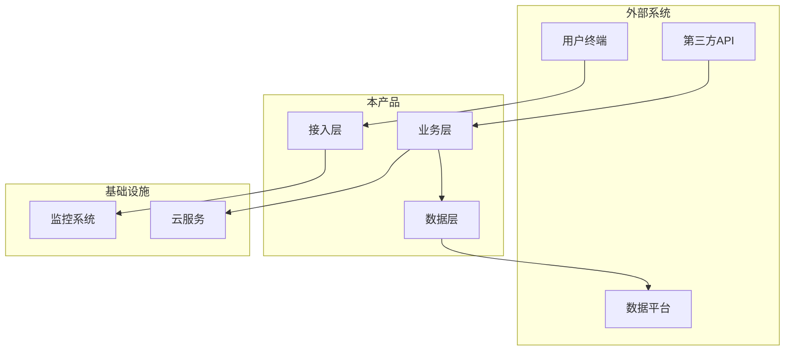
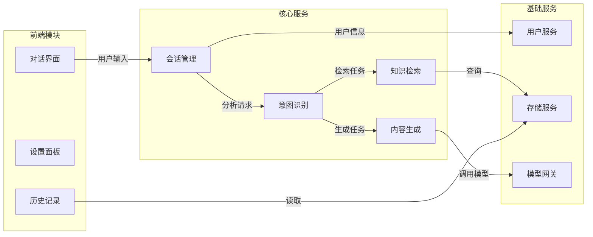
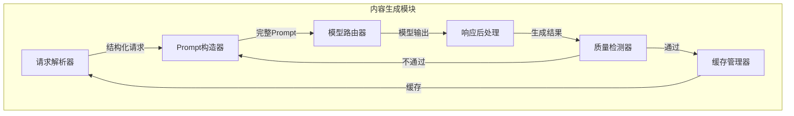
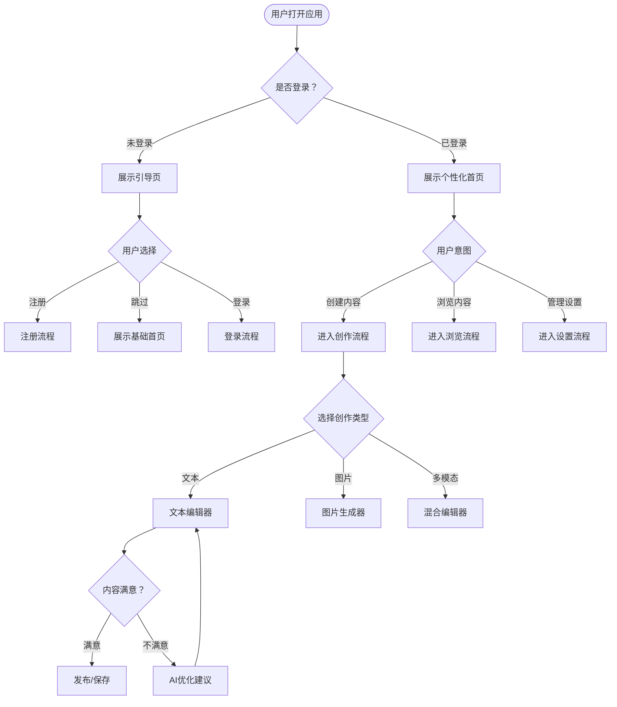
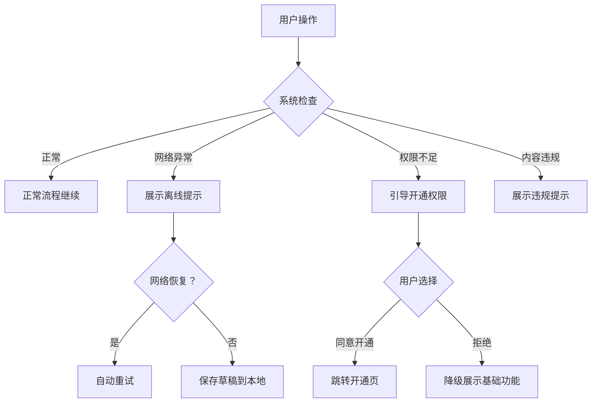
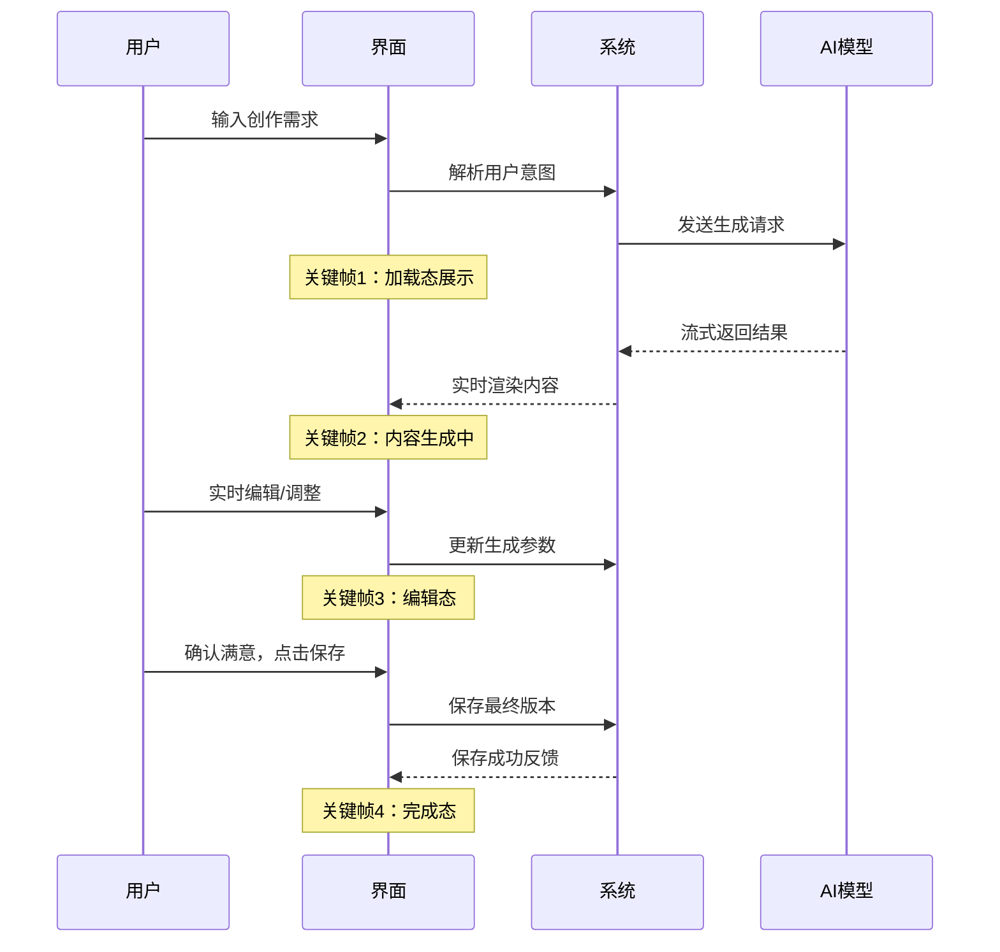
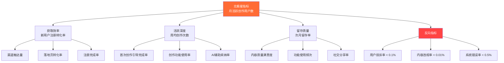
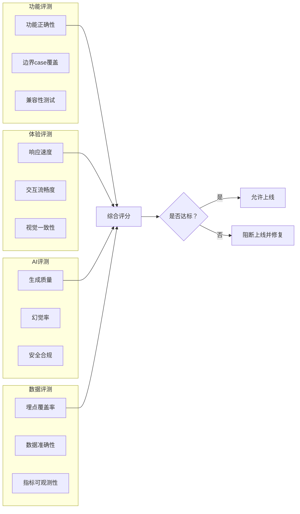

# 图表生成指南

本文档指导如何在PRD中生成各类图表，包括Mermaid语法示例和lark-whiteboard使用说明。

**核心原则**：图表的目的是降低理解成本，不是展示复杂性。清晰 > 全面 > 美观。

---

## 1. 产品架构图（三层）

### 宏观层：系统定位图

展示产品在整个技术生态中的位置和外部依赖关系。

**Mermaid示例**：

**写作要点**：
- 只展示系统级别的关系，不要进入模块细节
- 外部系统用不同颜色/区域区分
- 标注关键的数据流方向

### 中观层：模块关系图

展示核心模块间的交互关系和数据流转。

**Mermaid示例**：

**写作要点**：
- 模块之间的连线标注数据类型或调用目的
- 按前端/核心/基础分层排列
- 突出核心服务之间的关系

### 微观层：模块内部结构图

展示关键模块内部的组件关系。

**Mermaid示例**：

**写作要点**：
- 只对1-2个最关键的模块做微观展开
- 标注组件间的数据转换
- 包含错误/重试路径

---

## 2. 用户流程图（决策树风格）

### 核心特征

用户流程图采用「用户决策 + 系统响应」双轨设计，让读者同时理解用户行为和系统行为。

**Mermaid示例**：

**写作要点**：
- 菱形框表示用户决策点，矩形框表示系统动作
- 每个决策点标注所有可能的选项
- 标注循环路径（如"不满意→AI优化→重新编辑"）
- 所有路径都要有明确终点

### 异常流程补充

主流程图外，单独绘制异常处理流程：

---

## 3. 交互流程与关键帧

### 关键帧序列图

展示一个完整场景中的关键交互节点：

**写作要点**：
- Note标注是关键帧的位置
- 实线表示主动请求，虚线表示响应
- 标注关键的等待/加载时间点

---

## 4. 指标树图

### 北极星指标拆解

**写作要点**：
- 北极星指标用醒目颜色标注
- 反向指标用红色系标注
- 每个叶子节点标注目标值
- 层级不超过3层

---

## 5. 评测维度图

### 评测体系全景

---

## 6. 使用lark-whiteboard绘制

### 适用场景

当以下情况时，优先使用lark-whiteboard：
- 需要更灵活的布局（Mermaid不支持自由定位）
- 需要嵌入到飞书文档中
- 需要添加颜色编码、图标等视觉元素
- 团队更习惯在飞书中查看

### 调用方式

通过lark-whiteboard skill绘制，然后嵌入飞书文档。典型用法：

1. 明确图表类型（架构图/流程图/思维导图/时序图）
2. 准备图表数据结构
3. 调用lark-whiteboard生成
4. 获取图表链接嵌入PRD文档

### 降级方案

如果lark-whiteboard不可用，使用Mermaid代码块作为降级：
- 在飞书文档中以代码块形式嵌入
- 添加文字说明辅助理解
- 后续手动替换为正式图表

---

## 图表通用原则

1. **标注所有决策点**：每个菱形（决策）必须标注条件和所有分支
2. **清晰 > 全面**：一张图传达一个核心信息，不要试图在一张图里说完所有事
3. **统一配色**：同类元素使用同一颜色系，不超过5种主色
4. **文字精简**：图中文字不超过10个字，详细说明放在图外
5. **双向流转**：如果存在循环/重试，必须标注退出条件
6. **读者导向**：开发看的图强调数据流，PM看的图强调决策逻辑，设计看的图强调交互帧
